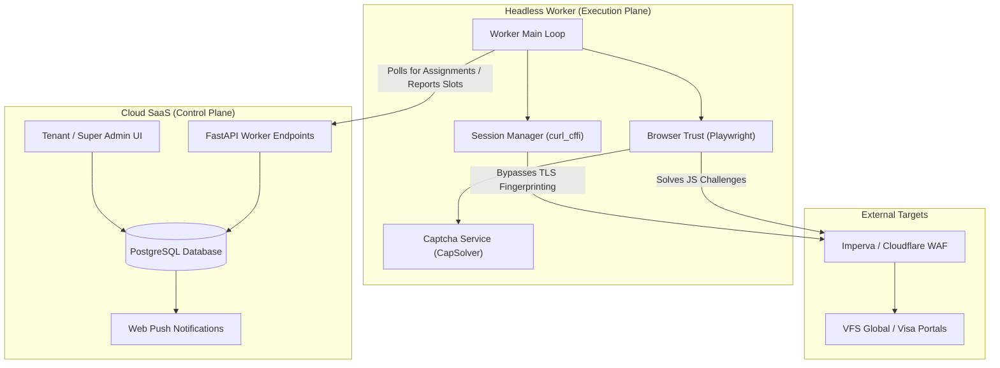

# System Dependency Map

This diagram illustrates the high-level dependencies between major system components.

---
*Last Reviewed: Sprint 09 | Implementation Verified: YES | Owner: Knowledge Manager | Confidence: High*
