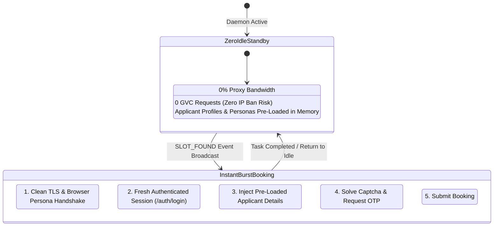
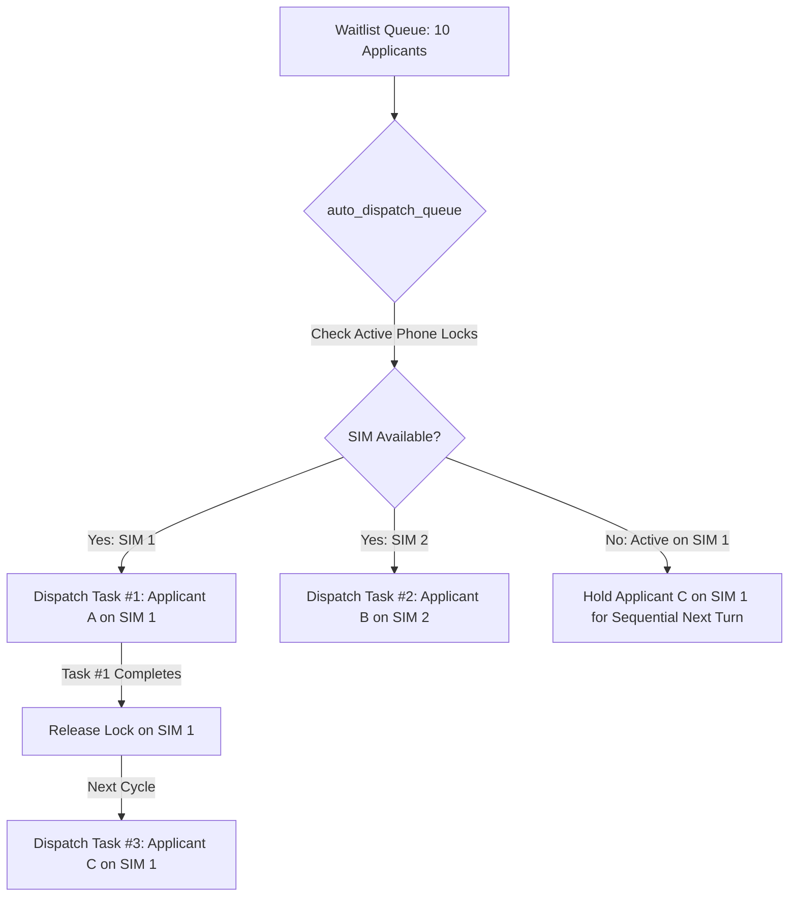

# Architecture Document 10: Booker Swarm, Sequential SIM Locking, Zero-Idle Standby & 7-Day HAR Retention

**Version:** 2.0  
**Status:** ACCEPTED  
**Owner:** Core Architecture Team  
**Date:** September 2026

---

## 1. Overview & System Purpose

This specification governs the high-performance execution plane for automated visa bookings on the GVC World Portal. It defines:
1. **Zero-Idle Warm Standby Execution**: Minimizing proxy bandwidth, IP ban risks, and auth token expiration during multi-week inter-drop dormant intervals.
2. **Multi-Client SIM Sharing & Sequential Phone Locking**: Enabling agency operations where 5–6 applicants share 1 physical SIM card without OTP collision.
3. **7-Day High-Fidelity HAR Network Retention**: Preserving complete request/response headers, payloads, cookies, and TLS metadata for rapid diagnosis.
4. **Booking Confirmation Pipeline & Verification Slips**: Capturing official booking reference codes and rendering printable client appointment slips in PWA/UI.
5. **Automated GitHub Actions CI/CD Pipeline**: Standardized zero-downtime deployment to Portainer VPS.

---

## 2. Zero-Idle Warm Standby Architecture

Because GVC slot releases occur weeks or months apart, persistent background keep-alives and long-term pre-authentication drain residential proxies and cause WAF session bans.

### Invariants:
1. **Dormant Period**: Zero HTTP requests sent to GVC. Zero proxy bandwidth consumed.
2. **Memory Staging**: Applicant details (names, passport numbers, dates of birth, phone numbers) and browser persona profiles are pre-validated in local memory buffers.
3. **Burst Execution**: When a `SLOT_FOUND` signal arrives, the booker worker executes a fresh login and 3-step booking sequence with clean residential IP proxies in sub-second bursts.

---

## 3. Multi-Client SIM Sharing & Sequential Phone Locking

When multiple applicants in the waitlist share a single agency SIM card (e.g. `+92-334-5112969`):

### Locking Invariant:
- `BookingTask.status in ['PENDING', 'CLAIMED']` acts as an active exclusive lock on `Applicant.phone_number`.
- Parallel workers execute concurrently across distinct phone numbers.
- Applicants sharing the same SIM are processed strictly sequentially, preventing OTP collisions.

---

## 4. 7-Day High-Fidelity HAR & Log Retention Policy

All diagnostic and WAF telemetry is governed by strict retention tiers:

| Log Type | Table / Handler | Retention Window | Storage Strategy |
| :--- | :--- | :--- | :--- |
| **Network Traces (HAR)** | `WorkerLog` | **7 Full Days** | JSON/HAR payload in DB; daily pruned by `MaintenanceService` for records $> 7$ days. |
| **Worker File Logs** | `TimedRotatingFileHandler` | **7 Days** | Daily rotation (`runlog.log`, `booker.log`) with 7-day backup count. |
| **Operational Events** | `EventLog` | **14 Days** | Info/warning events pruned after 14 days. |
| **System & Audit Logs** | `AuditLog` | **Permanent** | Tenant modifications and security events preserved indefinitely. |

---

## 5. Booking Confirmation & Official Receipt Verification

Upon successful appointment submission:
1. **Confirmation Capture**: The booker extracts `reference_number` (e.g. `GVC-ISB-2026-91823`) and appointment metadata.
2. **SaaS Storage**: Uploaded to `POST /api/v1/worker/booking-tasks/{task_id}/confirmation` and persisted in `BookingTask`.
3. **PWA / UI Modal**: Displays official confirmation slip with applicant details, passport number, visa center, reference badge, and print/download actions.

---

## 6. GitHub Actions CI/CD Pipeline

Deployments are automated via `.github/workflows/deploy.yml`:
- **Trigger**: Push to `main` (Production) or `feature/staging` (Staging).
- **Validation**: Python 3.12 syntax check, `flake8` linting, and automated unit test suites.
- **Delivery**: Triggers Portainer webhook for zero-downtime container stack reload.
