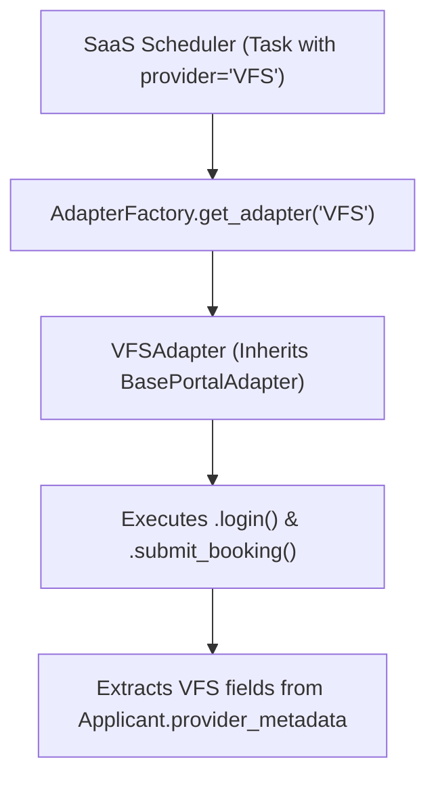

# Portal-Agnostic Scalability Audit & Verification Report

**Audit Date:** July 28, 2026  
**Audited Subsystems:** `cloud-saas` (Control Plane) & `operator-agent` (Execution Plane)  
**Reference Document:** [.ai/permanent/workflows/02-architecture-scalability.md](file:///f:/Playgrounds/bookingbot/.ai/permanent/workflows/02-architecture-scalability.md)  
**Overall Architecture Alignment:** **75% Implemented / Ready**

---

## 1. Executive Summary

An empirical audit was conducted to verify whether the current codebase correctly fulfills the **4 Pillars of Portal-Agnostic Architecture** (supporting **GVC**, **VFS Global**, **BLS International**, and **TLScontact** without codebase fragmentation).

### Summary Table

| Pillar | Architectural Requirement | Current Implementation Status | Compliance Score |
| :--- | :--- | :--- | :---: |
| **1. Execution Abstraction** | Abstract `BasePortalAdapter` & dynamic adapter factory in workers | `BasePortalAdapter` & `GVCAdapter` implemented. Missing `AdapterFactory` lookup in worker scripts. | **70%** |
| **2. Dynamic Data Schemas** | `Applicant.provider_metadata` (JSONB) for portal-specific fields | `provider_metadata` column exists in DB. UI form builder not yet hooked up. | **75%** |
| **3. Provider Routing** | Provider-filtered account matching & worker/proxy capabilities | `provider` field on Accounts, Assignments, Tasks. Account scoring filters by provider. Worker/Proxy provider scoping pending. | **80%** |
| **4. Captcha Abstraction** | Solver-agnostic Captcha service & challenge type requests | `CaptchaService` supports `capsolver`, `2captcha`, `anti-captcha`. Challenge type parameterization needed. | **85%** |

---

## 2. Detailed Layer-by-Layer Verification

### Pillar 1: Execution Plane Abstraction (`operator-agent`)

#### Verified Compliance:
- **`BasePortalAdapter` Interface ([portal_adapter.py](file:///f:/Playgrounds/bookingbot/ttttt/operator-agent/core/portal_adapter.py)):**
  - Defines clean abstract contracts: `login()`, `inject_applicant_data()`, `pass_pre_otp_captcha()`, `request_otp()`, `submit_otp_and_book()`, `close()`.
- **Provider Adapter Implementation ([gvc_adapter.py](file:///f:/Playgrounds/bookingbot/ttttt/operator-agent/core/gvc_adapter.py)):**
  - `GVCAdapter` cleanly inherits from `BasePortalAdapter` and encapsulates GVC-specific DOM navigation and TLS session headers.

#### Pinpointed Gaps / Mismatches:
- **Direct Adapter Instantiation:** `headless_booker.py` (Line 104) directly imports and instantiates `GVCAdapter` (`adapter = GVCAdapter(...)`).
- **Missing Adapter Factory:** There is no `AdapterFactory.get_adapter(provider_name)` in `operator-agent`. When a `VFS` or `BLS` task is received, the booker cannot dynamically load `VfsAdapter` without manual code edits.

---

### Pillar 2: Dynamic Field Schemas (`cloud-saas`)

#### Verified Compliance:
- **Database Model ([models.py](file:///f:/Playgrounds/bookingbot/ttttt/cloud-saas/app/models.py#L114)):**
  - `Applicant` table contains `provider_metadata = Column(JSONB, default=dict)`.
  - `WaitlistQueue` table contains `provider = Column(String, default="GVC")`.
  - Universal core fields (`firstname`, `surname`, `passportnumber`, `dateofbirth`, `nationality`) are stored as standard SQL columns.

#### Pinpointed Gaps / Mismatches:
- **UI Intake Form ([clients.html](file:///f:/Playgrounds/bookingbot/ttttt/cloud-saas/app/templates/clients.html)):**
  - The "Add Applicant" modal currently accepts fixed inputs. It does not yet dynamically render custom fields based on provider (e.g. VFS GWF number or BLS reference codes) into `provider_metadata`.

---

### Pillar 3: Scraper & Booker Routing Rules

#### Verified Compliance:
- **Provider Database Attributes ([models.py](file:///f:/Playgrounds/bookingbot/ttttt/cloud-saas/app/models.py)):**
  - `PortalAccount.provider` (Line 244)
  - `Assignment.provider` (Line 303)
  - `BookingTask.provider` (Line 320)
  - `WaitlistQueue.provider` (Line 125)
- **Provider-Aware Scheduler ([scheduler_service.py](file:///f:/Playgrounds/bookingbot/ttttt/cloud-saas/app/services/scheduler_service.py#L194)):**
  - `matching_provider_accounts` strictly filters accounts by `due_assignment.provider`.
- **Scoring Policy ([scoring_policy.py](file:///f:/Playgrounds/bookingbot/ttttt/cloud-saas/app/services/scoring_policy.py#L23)):**
  - Rejects account leases if `account.provider` does not match task provider.

#### Pinpointed Gaps / Mismatches:
- **Worker Node Provider Capabilities:** `WorkerNode` table ([models.py](file:///f:/Playgrounds/bookingbot/ttttt/cloud-saas/app/models.py#L148)) has `can_scrape` and `can_book` booleans, but lacks a `supported_providers` JSONB/String array.
- **Proxy Provider Scoping:** `Proxy.health_score` is global. A proxy blocked on Imperva (VFS) is currently penalized globally rather than per-provider.

---

### Pillar 4: Captcha & Diagnostics Abstraction

#### Verified Compliance:
- **Captcha Service Abstraction ([captcha_service.py](file:///f:/Playgrounds/bookingbot/ttttt/cloud-saas/app/core/captcha_service.py)):**
  - Configurable via `SystemSetting` key `captcha.provider` (`capsolver`, `2captcha`, `anti-captcha`).
- **Diagnostics Simulation ([ui.py](file:///f:/Playgrounds/bookingbot/ttttt/cloud-saas/app/routers/ui.py#L1756)):**
  - Endpoints `/api/diagnostics/test-captcha` and `/api/diagnostics/simulate-event` allow live provider testing.

#### Pinpointed Gaps / Mismatches:
- **Challenge Type Parameterization:** The worker should pass explicit challenge parameters (`recaptcha_v2`, `turnstile`, `hcaptcha`, `datadome_slide`) from the active `PortalAdapter` to `CaptchaService`.

---

## 3. Recommended Remediation Plan (To Reach 100% Portal Agnostic)



### Action Items:

1. **Implement `AdapterFactory` in `operator-agent`:**
   - Create `core/adapter_factory.py`:
     ```python
     class AdapterFactory:
         @staticmethod
         def get_adapter(provider: str, **kwargs) -> BasePortalAdapter:
             provider_upper = (provider or "GVC").upper()
             if provider_upper == "GVC":
                 return GVCAdapter(**kwargs)
             elif provider_upper == "VFS":
                 return VFSAdapter(**kwargs)
             raise ValueError(f"Unsupported provider: {provider}")
     ```
   - Refactor `headless_booker.py` line 104 to use `AdapterFactory.get_adapter(task.get('provider', 'GVC'), ...)`.

2. **Add `supported_providers` to `WorkerNode` model:**
   - Add `supported_providers = Column(JSONB, default=lambda: ["GVC"])` to `WorkerNode` in `models.py`.
   - Update `scheduler_service.py` to match leases only to workers supporting the task's provider.

3. **Expose Dynamic `provider_metadata` in Client Intake Modal:**
   - Update `clients.html` and `create_client` in `ui.py` to accept provider-specific key-value pairs stored directly into `Applicant.provider_metadata`.
