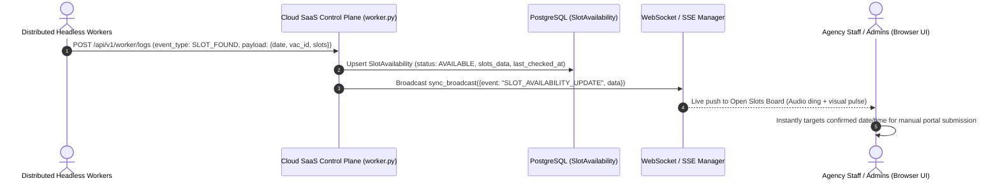

# Live Slot Availability Calendar & Peak-Drop Board

## 1. Intent and Purpose
During high-traffic visa slot drop windows (e.g. quarterly or monthly GVC release events), agency staff need instant, unambiguous visibility into which specific dates and times have confirmed open slots across visa centers.

Currently, staff are forced to manually click through dozens of calendar dates on the portal, hitting rate limits and wasting precious seconds on dates that have no open appointments.

The **Live Slot Availability Calendar & Peak-Drop Board** provides a real-time, zero-latency visual dashboard and ticker displaying:
1. **Target Visa Centers:** (e.g., VAC 137 Islamabad, VAC 138 Lahore).
2. **Open Dates & Times:** Exact dates (e.g., 15/09/2026, 17/09/2026) and specific time slots (e.g., 02:00 AM, 09:00 AM, 11:30 AM).
3. **Capacity & Slot Counts:** Total available slots remaining on each date.
4. **Appointment Categories:** Visually distinguished by type (National Visa Type D `2`, Seasonal Type D `26`, Prime Time `6`, Premium Lounge `5`).
5. **Real-Time Push/WebSocket Updates:** Auto-updating without manual page refreshes as distributed workers emit `SLOT_FOUND` and `NO_SLOTS_FOUND` events.

This empowers agency staff to immediately target exact dates and times for manual bookings while automated booker workers concurrently dispatch their queues.

---

## 2. Invariants & Business Logic
1. **Data Source of Truth:**
   - Powered by the existing `SlotAvailability` PostgreSQL table (`models.py`) and live worker `SLOT_FOUND` event payloads.
2. **Freshness & Expiration Invariant:**
   - Slot records are given a **freshness TTL** (e.g., 10 minutes from `last_checked_at`).
   - If a subsequent check on the same date/center returns `NO_SLOTS_FOUND`, the slot status transitions immediately to `UNAVAILABLE` or `DEPLETED`.
3. **Center & Category Tagging:**
   - Slot availability records must explicitly preserve `vac_id` and `app_type` so staff never attempt booking an invalid visa category on an open date.
4. **Copy-to-Clipboard & One-Click Direct Navigation:**
   - Each active slot card includes one-click buttons to copy the date/time string or open the portal booking form pre-targeted to that center.

---

## 3. Architecture & Data Flow

---

## 4. UI/UX Specification (SaaS Dashboard)
- **Top Bar Live Slot Ticker:** A persistent glowing ticker across the top of the SaaS dashboard during active open slot events (e.g., `🟢 2 Slots Available: VAC 138 (Lahore) on 17/09/2026 at 09:00 AM [Type D]`).
- **Interactive Calendar / Heatmap View:**
  - Standard monthly calendar view.
  - Dates with open slots glow green with a counter badge indicating total available slots.
  - Clicking any date expands a detailed drawer displaying the individual time slots, capacity, and appointment category.
- **Audio / Toast Alert:** Optional audio chime when a new open slot drop is broadcasted via WebSockets.

---

## 5. Implementation Roadmap (Future Sprint)
1. **Backend:**
   - Add endpoint `GET /api/v1/slots/live-board` returning currently active, non-expired `SlotAvailability` records grouped by visa center and appointment type.
   - Stream real-time slot state changes over `sync_broadcast()`.
2. **Frontend UI:**
   - Create `app/templates/slots_board.html` (or integrate directly into `dashboard_logs.html` and `index.html`).
   - Implement live calendar grid and slot cards with auto-updating WebSocket listeners.

---
*Created: August 29, 2026 | Documented per Operational Staff Request | Status: Scheduled for Implementation*
