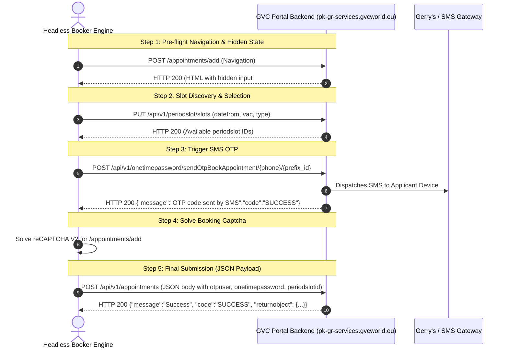

# GVC Booking Flow: HAR Analysis & Identified Implementation Gaps

## 1. Overview & Context
This document records the exact network traffic findings from reverse-engineering the user-provided booking HAR recordings in `ttttt/RnD/sample-booking-form/` (specifically `complete-booking-workflow-with-wrong-otp-with-otp-mismatch-err-2.har`).

Prior implementations operated under partial traces (which ended at `/api/v1/periodslot/slots`). The comprehensive HAR recordings capture the entire live transaction lifecycle from slot selection through OTP triggering and final submission.

---

## 2. Identified Protocol & Schema Gaps



---

### Comparison Table: Implemented Code vs. Real Portal HAR

| Protocol Aspect | Prior / Current Code | Actual GVC Portal (from HAR) | Severity |
| :--- | :--- | :--- | :--- |
| **OTP Request Endpoint** | `POST /api/v1/otp/send` (placeholder) | `POST /api/v1/onetimepassword/sendOtpBookAppointment/{phone}/{prefix_id}` | 🔴 **CRITICAL** |
| **OTP Request Body** | JSON `{"phone": phone}` | Empty Body (`content-length: 0`, URL path parameters) | 🔴 **CRITICAL** |
| **Booking Submission Endpoint** | `POST /appointments/add` | `POST /api/v1/appointments` | 🔴 **CRITICAL** |
| **Booking Content-Type** | `application/x-www-form-urlencoded` | `application/json; charset=UTF-8` | 🔴 **CRITICAL** |
| **Hidden Session Token** | Ignored / Missing | `otpuser` string extracted from `<input type="hidden" name="otpuser" id="otpuser" value="User{id=...}"/>` | 🔴 **CRITICAL** |
| **OTP Field Key** | `otp` | `onetimepassword` | 🔴 **CRITICAL** |
| **Slot ID Location** | Flat key `periodslot` at root | Nested inside each applicant object: `applicants[0].periodslotid` | 🔴 **CRITICAL** |
| **Prefix & Country IDs** | Flat string prefix | `phonenumberprefix: {"id": "197"}`, `nationality: {"id": "197"}` (Objects) | 🟡 **HIGH** |
| **Travel Document Expiry Key** | `passport_expiry` | `traveldocumentvaliduntil` (`"DD/MM/YYYY"`) | 🟡 **HIGH** |
| **Mandatory Checkbox Flags** | Missing | `submitinfo: "on"`, `submissionMsgCheck: "Make sure that you have checked the required checkbox"` | 🟡 **HIGH** |
| **Slot Timing Field** | Missing in final body | `selectedtime: "12:00"`, `datefrom: "12/08/2026"`, `appointmentmethod: "1"` | 🟡 **HIGH** |

---

## 3. Detailed Request Specifications (HAR Baseline)

### A. Trigger SMS OTP Request
* **Method:** `POST`
* **URL:** `https://pk-gr-services.gvcworld.eu/api/v1/onetimepassword/sendOtpBookAppointment/{phonenumber}/{phone_prefix_id}`
* **Example:** `POST /api/v1/onetimepassword/sendOtpBookAppointment/3345112969/197` (where `197` is Pakistan +92 prefix ID in GVC database)
* **Headers:**
  ```http
  Accept: */*
  Referer: https://pk-gr-services.gvcworld.eu/appointments/add
  X-Requested-With: XMLHttpRequest
  Content-Length: 0
  ```
* **Response:**
  ```json
  {
    "message": "OTP code sent by SMS",
    "returnobject": null,
    "code": "SUCCESS"
  }
  ```

---

### B. Final Appointment Booking Request
* **Method:** `POST`
* **URL:** `https://pk-gr-services.gvcworld.eu/api/v1/appointments`
* **Headers:**
  ```http
  Accept: */*
  Content-Type: application/json; charset=UTF-8
  Referer: https://pk-gr-services.gvcworld.eu/appointments/add
  X-Requested-With: XMLHttpRequest
  ```
* **Payload Structure:**
  ```json
  {
    "otpuser": "User{id=931995, username=amr.shah@gmail.com, password=5e80b93c0a7aef7bad58901b480ea650b6212292, firstname=AMR, lastname=SHAH, email=amr.shah@gmail.com, country=Vcountry{id=19, name=PAKISTAN}, vac=Vac{id=137, name=Islamabad Visa Application Center for Greece}, roles=null, userroles=[eu.ubitech.gvcw.repository.domain.UserRole@1d6e9e2c]}",
    "vac": "137",
    "type": "26",
    "bookingfor": "0",
    "members": "1",
    "email": "amr.shah@gmail.com",
    "phonenumberprefix": {
      "id": "197"
    },
    "phonenumber": "3345112969",
    "applicants": [
      {
        "surname": "SHAH",
        "firstname": "AMR",
        "dateofbirth": "03/07/1944",
        "passportnumber": "FS9910272",
        "traveldocumentvaliduntil": "27/07/2027",
        "gender": {
          "id": "2"
        },
        "nationality": {
          "id": "197"
        },
        "periodslotid": "2528256"
      }
    ],
    "datefrom": "12/08/2026",
    "selectedtime": "12:00",
    "appointmentmethod": "1",
    "submitinfo": "on",
    "submissionMsgCheck": "Make sure that you have checked the required checkbox",
    "onetimepassword": "55613",
    "g-recaptcha-response": "0cAFcWeA..."
  }
  ```

---

## 4. Response & Error Signatures

### 1. OTP Mismatch / Invalid Response:
```json
{
  "message": "Mismatch OTP. Please, try again",
  "returnobject": null,
  "code": "INVALID"
}
```

### 2. Success Response:
```json
{
  "message": "Success",
  "returnobject": {
    "reference": "GVCW-GR-ISB-20261022-8899",
    "appointmentId": 2528256,
    "status": "CONFIRMED"
  },
  "code": "SUCCESS"
}
```
